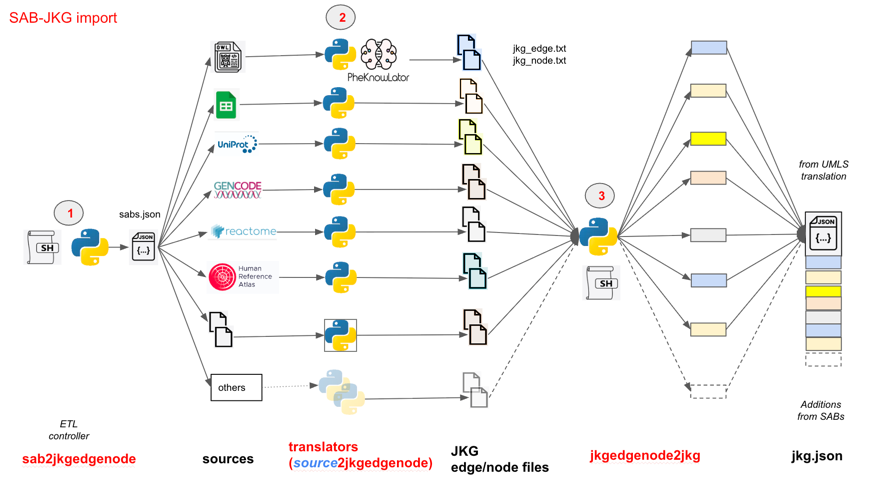

# ubkg-jkg-generation
The **generation framework** for the Unified Biomedical Knowledge Graph-JSON Knowledge Graph format (UBKG-JKG)
comprises a suite of Extraction, Translation, and Load (ETL) processes that
* obtains data from standard biomedical sources not maintained in the National Library of Medicine's **Unified Medical Language System** ([UMLS](https://www.nlm.nih.gov/research/umls/index.html))
* translates data into files in **JKG edge/node** (**JKGEN**) format.
* adds data from JKG edge node files to a **JKG JSON** file built from a UMLS release by means of the [jkg-umls](https://github.com/x-atlas-consortia/ubkg-jkg-umls) architecture.

# JKG Edge/Node (JKGEN) format
The **JKG Edge/Node format** is an enhanced triplet representation of ontological information. 
The format is based on the [OWL-NETS](https://github.com/callahantiff/PheKnowLator/wiki/OWL-NETS-2.0) format.

Differences between JKGEN and OWL-NETS include:
## Entity (node) representation
1. OWL-NETS represents entities in assertions (**subject** and **object** in  **subject**-_**predicate**_-**object**) with full International Resource Identifiers (IRIs).
   For example, UBERON represents "cranial fossa" with the IRI http://purl.obolibrary.org/obo/UBERON_0008789.
2. JKGEN represents entities in assertions in the format **SAB**:**code**, where 
   * **SAB** is the designated _Source ABbreviation_ for the data source. The SAB is usually an acronym.
   * **code** is the code for an entity in the SAB.
   For example, the JKGEN representation of Uberon's "cranial fossa" is **UBERON:0088789**.
3. JKGEN standardizes codes both to match UMLS conventions and for use as node labels in neo4j.

## Relationship (edge) representation
1. OWL-NETS represents the predicates of assertions with full IRIs. 
   Most of the relationship IRIs in OWL-NETS can be found in the [Relations Ontology](https://obofoundry.org/ontology/ro.html).
   For example, OWL-NETS represents the relationship "part_of" with the IRI http://purl.obolibrary.org/obo/BFO_0000050.
2. JKGEN represents relationships with standardized labels--e.g., "part_of".
3. Relationship labels are of the following types:
   * labels from the corresponding relationship nodes in the Relations Ontology
   * labels from other ontologies--e.g., OBI. In some cases, the Open Biomedical and Biological Ontology Foundry ([OBO](https://obofoundry.org/)) maintains cross-walks for relations that are not found in the Relations Ontology.
   * custom labels 
4. JKGEN standarizes relationship labels so that they can be used as relationship labels in queries in neo4j without requiring the back-tick (**`**) delimiter.

## Output files
For each non-UMLS SAB,
1. OWL-NETS generates three TSV files:
   * OWL-NETS_edgelist.tsv - assertion triplets
   * OWL-NETS_node_metadata.tsv - node information
   * OWL-NETS_relations.tsv - node information
2. JKGEN generates two TSV files:
   * jkg-edge.tsv - assertion triplets
   * jkg-node.tsv - node information

# Architecture and workflow 


The JGKEN generation framework comprises:
* a **controller application** (**sab2jkgen**)
* **source translator applications** that 
  * obtain data from sources
  * convert data to JKGEN format
* an **JKG import** application (**jkgen2jkg**) that adds data from files in JGKEN format to a JKG JSON built from a UMLS release

## Component patterns
1. The controller and JKG import applications comprise:
   * a Bash shell script that
     * establishes a Python virtual environment
     * installs Python packages from a common _requirements.txt_ file
     * obtains configuration from a common _ubkg.ini_ file
     * executes a Python script
2. The Bash shell script and the Python script components of an application share a file name, but use different file extensions.

# sab2jkgen
The **sab2jkgen** controller application:
1. Obtains ETL configuration from **sources.json**
2. Passes information to a source translator application

## sources.json
The **sources.json** file provides information on non-UMLS sources.
**sources.json** is a dict of dicts. The key for each internal dict is a SAB.

### keys and values

#### For OWL sources
| key         | value description                                    |
|-------------|------------------------------------------------------|
| source_type | type of source                                       |
| owl_url     | download URL for OWL file                            |
| name        | name of the OWL's ontology                           |
| description | description of the OWL's ontology                    |
| version     | version of the OWL                                   |
| history     | dict of historical metrics from download and parsing |

#### Example
```azure
"EFO": {
    "source_type": "owl",
    "owl_url": "https://data.bioontology.org/ontologies/EFO/submissions/262/download?apikey=8b5b7825-538d-40e0-9e9e-5ab9274a9aeb",
    "name": "Experimental Factor Ontology (EFO)",
    "description": "The Experimental Factor Ontology (EFO) is an application focused ontology modelling the experimental variables in multiple resources at the EBI and Open Targets.",
    "version": "v3.65.0",
    "history": {
      "download_size_mb": 218,
      "download_time_minutes": 3,
      "parse_time_seconds": 60
    }
  },
```
#### for other source types

| key         | value description                                           |
|-------------|-------------------------------------------------------------|
| source_type | type of source                                              |
| execute     | relative path to Python script, with command line arguments |
| name        | name of the source                                          |
| description | description of the source                                   |
| version     | version of the source                                       |
| execute_url | additional URL (used for UNIPROTKB translator)              |

#### Example
```azure
"4DN": {
    "source_type": "ubkg_edge_node",
    "execute": "./translators/ubkg_edgenode2edgenode/ubkg_edgenode2edgenode.py 4DN",
    "name": "Data Distillery: 4D Nucleome (4DN)",
    "description": "Chromatin loops called from Hi-C experiments performed in select cell lines.",
    "version": "2023-AUG-24"
  }
```
# Source translator applications
Each source translator application resides in its own
directory in the _/generation_framework/translators_ path of the repository.

Source translations are independent.

### Tool patterns
1. Most source translator applications comprise:
   * a Python script 
   * an INI file that is excluded by .gitignore
   * an associated _ini.example_ file
   * a README.md documentation file
2. Files share a file name in format _source type_ 2 _jkgen_.

# jkgen2jkg
The **jkgen2jkg** application adds information from the JKGEN files
of a SAB created by the **sab2jkgen** application to a file in JKG JSON format.

The **jkgen2jkg** application implements the _UBKG-JKG equivalence class algorithm_.

# ubkgjkg.ini
**sab2jkgen** and **jkgen2jkg** are configured by means of the **ubkg.ini** file.

