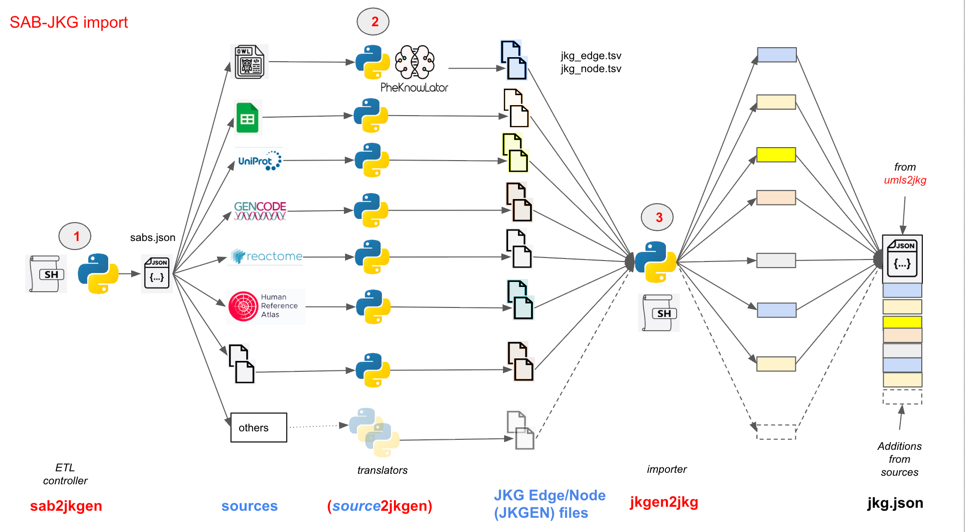

# ubkg-jkg-generation
The **generation framework** for the Unified Biomedical Knowledge Graph-JSON Knowledge Graph format (UBKG-JKG)
comprises a suite of Extraction, Translation, and Load (ETL) processes that
* obtains data from standard biomedical sources not maintained in the National Library of Medicine's **Unified Medical Language System** ([UMLS](https://www.nlm.nih.gov/research/umls/index.html))
* translates data into files in **JKG edge/node** (**JKGEN**) format.
* integrates data from JKG edge node files to a **JKG JSON** file built from a UMLS release by means of the [jkg-umls](https://github.com/x-atlas-consortia/ubkg-jkg-umls) architecture.

# UMLS JKG JSON
The JKG integration of data from a set of JKGEN assumes the presence of a file that complies with the JKG Schema and populated
from a release of the UMLS. 

It would be possible to start from empty--i.e., without data from the UMLS. However, such a 
JKG would likely be of limited value: a significant application of JKG is to connect concepts
across multiple data sources. 

Reference implementations of the JKG, including the
UBKG-JKG, start from UMLS.

# JKG Edge/Node (JKGEN) format
The **JKG Edge/Node format** is an enhanced triplet representation of ontological information. 
The format is based on the [OWL-NETS](https://github.com/callahantiff/PheKnowLator/wiki/OWL-NETS-2.0) format.

Differences between JKGEN and OWL-NETS include:
## Entity (node) representation
1. OWL-NETS represents entities in assertions (**subject** and **object** in  **subject**-_**predicate**_-**object**) with full International Resource Identifiers (IRIs).
   For example, UBERON represents "cranial fossa" with the IRI http://purl.obolibrary.org/obo/UBERON_0008789.
2. JKGEN represents entities in assertions in the format **SAB**:**code**, where 
   * **SAB** is the designated _Source ABbreviation_ for the data source. The SAB is usually an acronym.
   * **code** is the code for an entity in the SAB.
   For example, the JKGEN representation of Uberon's "cranial fossa" is **UBERON:0088789**.
3. JKGEN standardizes codes both to match UMLS conventions and for use as node labels in neo4j.

## Relationship (edge) representation
1. OWL-NETS represents the predicates of assertions with full IRIs. 
   Most of the relationship IRIs in OWL-NETS can be found in the [Relations Ontology](https://obofoundry.org/ontology/ro.html).
   For example, OWL-NETS represents the relationship "part_of" with the IRI http://purl.obolibrary.org/obo/BFO_0000050.
2. JKGEN represents relationships with standardized labels--e.g., "part_of".
3. Relationship labels are of the following types:
   * labels from the corresponding relationship nodes in the Relations Ontology
   * labels from other ontologies--e.g., OBI. In some cases, the Open Biomedical and Biological Ontology Foundry ([OBO](https://obofoundry.org/)) maintains cross-walks for relations that are not found in the Relations Ontology.
   * custom labels 
4. JKGEN standarizes relationship labels so that they can be used as relationship labels in queries in neo4j without requiring the back-tick (**`**) delimiter.

## Output files
For each non-UMLS SAB,
1. OWL-NETS generates three TSV files:
   * OWL-NETS_edgelist.tsv - assertion triplets
   * OWL-NETS_node_metadata.tsv - node information
   * OWL-NETS_relations.tsv - node information
2. JKGEN generates two TSV files:
   * jkg-edge.tsv - assertion triplets
   * jkg-node.tsv - node information

# Architecture

The JGKEN generation framework comprises:
* a **controller application** (**sab2jkgen**)
* **source translator applications** that 
  * obtain data from sources
  * convert data to JKGEN format
* a **JKG import** application (**jkgen2jkg**) that adds data from files in JGKEN format to a JKG JSON built from a UMLS release



# Workflow
To integrate data from a data source (SAB) into an existing JKG JSON:

## Convert source to JKGEN
1. Execute [**sab2jkgen**.sh](https://github.com/x-atlas-consortia/ubkg-jkg-generation/blob/main/README.md#sab2jkgen) with the SAB as argument. 
2. **sab2jkgen.py** executes the [source translator](https://github.com/x-atlas-consortia/ubkg-jkg-generation/blob/main/README.md#source-translator-applications) appropriate for the SAB.
3. The source translator generates two files in JKGEN format:
   * an edge file
   * a node file
## Integrate JKGEN into JKG JSON
1. Execute [**jkgen2jkg.sh**](https://github.com/x-atlas-consortia/ubkg-jkg-generation/blob/main/README.md#jkgen2jkg) with the SAB as argument.
2. **jkgen2jkg.py** will:
   * read the JGKEN files for the SAB
   * read the JKG JSON
   * build new nodes and rels objects for the SAB
   * write nodes back to the JKG JSON in the following order:
      * existing Source nodes
      * new Source node for the SAB
      * existing Node_Label nodes
      * existing Rel_Label nodes
      * new Rel_Label nodes
      * existing Concept nodes
      * new Concept nodes
      * existing Term nodes
      * new Term nodes
   * write rels back to the JKG JSON in the following order:
      * existing rels (concept-concept relationships)
      * new rels
      * existing coderels (concept-code relationships)
      * new coderels

# Component patterns
1. The controller and JKG import applications comprise:
   * a Bash shell script that
     * establishes a Python virtual environment
     * installs Python packages from a common _requirements.txt_ file
     * obtains configuration from a common _ubkg.ini_ file
     * executes a Python script
2. The Bash shell script and the Python script components of an application share a file name, but use different file extensions.

# Component: sab2jkgen
The **sab2jkgen** controller application:
1. Obtains ETL configuration from **sources.json**
2. Passes information to a source translator application

## sources.json
The **sources.json** file provides information on non-UMLS sources.
**sources.json** is a dict of dicts. The key for each internal dict is a SAB.

### keys and values

#### For OWL sources
| key         | value description                                    |
|-------------|------------------------------------------------------|
| source_type | type of source                                       |
| owl_url     | download URL for OWL file                            |
| name        | name of the OWL's ontology                           |
| description | description of the OWL's ontology                    |
| version     | version of the OWL                                   |
| history     | dict of historical metrics from download and parsing |

#### Example
```azure
"EFO": {
    "source_type": "owl",
    "owl_url": "https://data.bioontology.org/ontologies/EFO/submissions/262/download?apikey=8b5b7825-538d-40e0-9e9e-5ab9274a9aeb",
    "name": "Experimental Factor Ontology (EFO)",
    "description": "The Experimental Factor Ontology (EFO) is an application focused ontology modelling the experimental variables in multiple resources at the EBI and Open Targets.",
    "version": "v3.65.0",
    "history": {
      "download_size_mb": 218,
      "download_time_minutes": 3,
      "parse_time_seconds": 60
    }
  },
```
#### for other source types

| key         | value description                                           |
|-------------|-------------------------------------------------------------|
| source_type | type of source                                              |
| execute     | relative path to Python script, with command line arguments |
| name        | name of the source                                          |
| description | description of the source                                   |
| version     | version of the source                                       |
| execute_url | additional URL (used for UNIPROTKB translator)              |

#### Example
```azure
"4DN": {
    "source_type": "ubkg_edge_node",
    "execute": "./translators/ubkg_edgenode2edgenode/ubkg_edgenode2edgenode.py 4DN",
    "name": "Data Distillery: 4D Nucleome (4DN)",
    "description": "Chromatin loops called from Hi-C experiments performed in select cell lines.",
    "version": "2023-AUG-24"
  }
```
# Source translator applications
Each source translator application resides in its own
directory in the _/generation_framework/translators_ path of the repository.

Source translations are independent.

## Tool patterns
1. Most source translator applications comprise:
   * a Python script 
   * an INI file that is excluded by .gitignore
   * an associated _ini.example_ file
   * a README.md documentation file
2. Files share a file name in format _source type_ 2 _jkgen_.

# Component: jkgen2jkg
The **jkgen2jkg** application integrates information from the JKGEN files
of a SAB created by the **sab2jkgen** application into a file in JKG JSON format.

The **jkgen2jkg** application allows the construction of a JKG _context_, or a JKG JSON 
file comprising information from multiple sources.

## UBKG-JKG context
A UBKG-JKG context extends the JKG JSON created from the UMLS by
integrating information from non-UMLS data sources.

To maximize linkages between concepts and codes in the UBKG-JKG, **jkgen2jkg** implements the following
algorithms:
* the UBKG-JKG [equivalence algorithm](https://github.com/x-atlas-consortia/ubkg-jkg-generation/blob/main/docs/UBKG-JKG%20equivalence%20algorithm.md)
* the UBKG-JKG [update algorithm](https://github.com/x-atlas-consortia/ubkg-jkg-generation/blob/main/docs/UBKG-JKG%20correction%20algorithm.md)

## Analytic outputs
**jkgen2jkg** creates the output files in the _sab_jkg_ directory of a SAB, summarizing
the state of the ingestion of the SAB.

### node_counts.tsv
This is a report showing the changes in numbers of nodes in JKG before and after ingestion of the SAB.

Example (UBERON)

| type          | before  | after   | updated |
|---------------|---------|---------|---------|
| Source        | 108     | 109     | n/a     |
| Node_Label    | 127     | 127     | n/a     |
| Rel_Label     | 117     | 589     | n/a     |
| Concept       | 3239707 | 3248635 | n/a     |
| Term          | 7855447 | 7630918 | n/a     |
| CODE rels     | 9086510 | 9145528 | n/a     |
| non-CODE rels | 9672922 | 9721494 | n/a     |

### node_cuis.csv
This is a file showing the results of the equivalence algorithm for each
node in the node file.

Relevant columns:

| column       | description                                        | example                                                                                                                                                                                                                                   |
|--------------|----------------------------------------------------|-------------------------------------------------------------------------------------------------------------------------------------------------------------------------------------------------------------------------------------------|
| node_id      | code for the node in the SAB                       | UBERON:0002192                                                                                                                                                                                                                            |
| node_dbxrefs | list of cross-references                           | ['fma:74512', 'tao:0001075', 'emapa:17768', 'vhog:0001756', 'ehdaa2:0000250', 'emapa:17548', 'umls:c0262212', 'zfa:0001075', 'fma:83715', 'mba:116', 'bams:chf', 'ehdaa:7567', 'dhba:12094', 'bams:chfl', 'neuronames:24', 'ncit:c32311'] |
| cuis         | list of CUIs assigned by the equivalence algorithm | ['UMLS:C0262212', 'UMLS:C2337254']                                                                                                                                                                                                        |


### changed_cuis.csv
This is a file showing the results of the update algorithm.

Relevant columns:

| column             | description                                                                       | example        |
|--------------------|-----------------------------------------------------------------------------------|----------------|
| properties_code_id | code for the node in the node file                                                | CL:0000127     |
| old_cui            | CUI assigned to the code in a prior ingestion                                     | CL:0000127 CUI |
| new_cui            | CUI assigned to the node in the current ingestion (via the equivalence algorithm) | UMLS:C0004112  |

# ubkgjkg.ini
**sab2jkgen** and **jkgen2jkg** are configured by means of the **ubkg.ini** file.

# Memory management
Analytical tasks in these scripts (especially **jkgen2jkg**) require reading large amounts of information into memory from 
files in the local system, such as the JKGJSON. As the source files grow (such as the JKG JSON after multiple ingestinos), 
memory pressure will increase, and swapping is likely.

To address memory pressure issues, scripts attempt to minimize memory by 
explicit unloading and garbage collection.

## Memory profiling
The Bash scripts wrap their execution of their corresponding Python scripts with the
[memory_profiler](https://github.com/pythonprofilers/memory_profiler) package. The 
memory profiler monitors memory consumption at regular intervals.

The memory profiler generates two monitoring files in the _memory_profiling_ directory for each
execution of a script:
* a data file
* a chart

The files for a particular execution are stamped with the name of the 
script and the execution time. For example, _mprofile_jkgen2jkg_20260515_094307.dat_ corresponds to 
the memory profiler's data file for an execution of **jkgen2jkg** on May 5, 2026 at 09:43:307.

The **jkgen2jkg** script pauses before terminating to allow the memory profiler time
to terminate gracefully.


