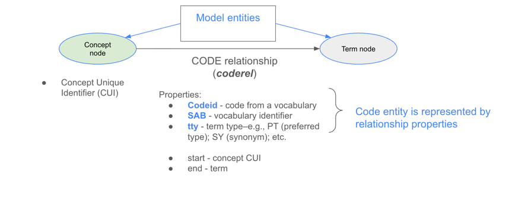
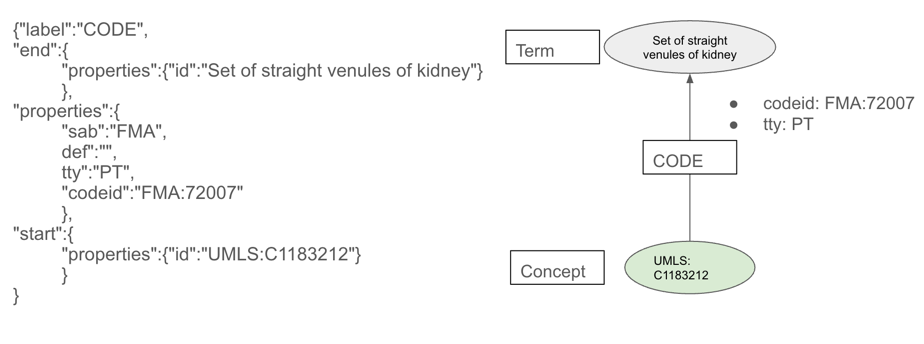
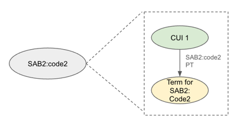
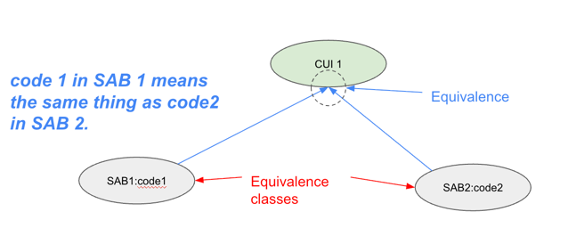

# UBKG-JKG equivalence  algorithm

# Concepts, Terms, and codes in JKG

The [JKG data model](https://github.com/x-atlas-consortia/json-knowledge-graph#jkg-data-model) is
both a simplification of the UMLS concept
model and an extension of that model to vocabularies
outside of the UMLS.

In the UMLS model, 
1. a _concept_ is a discrete representation of an idea.
2. a _code_ is a discrete representation of a concept in a vocabulary.
3. A _term_ describes a code. Generally, a code has a _preferred term_ and possibly _synonym_ terms.

A particular characteristic of the JKG data model is that it represents 
one of its entities by means of a relationship instead of a node. 
In the JKG model, a _code_ (the discrete representation of a _concept_ in a
vocabulary) comprises a set of properties on the _relationship_ between _**Concept**_ and **_Term_** nodes.

In a **_JKG JSON_** (a JSON file that conforms to the JKG Schema), a relationship that
encodes a code as a link between a Concept node and a Term node is called a
_coderel_. The illustration shows the example of the code FMA:72007, which encodes
the UMLS concept C1183212 in the FMA ontology.

## Shorthand: code "node"
To simplify discussion, a code in JKG will be represented 
as a node linked to a Concept node, even though the code is actually a set of properties on a relationship
between a Concept node and a Term node.

# Equivalence
In the UBKG-JKG, if two codes share a Concept, the codes are _equivalent_: both codes represent the same concept,
in different vocabularies. The two codes (properties of coderels) are referred to as 
equivalence classes.

Equivalence is the foundation of the UBKG-JKG's ability to link information from different biomedical sources.
Another way to describe equivalence is _concept-code synonymy_--a code from one source is 
synonymous to a code in another vocabulary if the two codes link to the same concept.

## Equivalences in the node file
A SAB specifies the equivalences for a code in the _node_dbxrefs_ column of the 
node file in [JKGEN format](https://github.com/x-atlas-consortia/ubkg-jkg-generation/blob/main/README.md#jkg-edgenode-jkgen-format).

The value of a node_dbxrefs column for a code is a pipe-delimited list of references.
For example, in UBERON, UBERON:0001748 has the following value for _node_dbxrefs_:
`emapa:35663|fma:55566|umls:c0927176|ma:0002676|ncit:c33265`

The format of each element in node_dbxrefs is _SAB_:_identifier in SAB_. Node files
will specify two types of dbxrefs:
1. If the _SAB_ is **UMLS**, then the dbxref corresponds to a UMLS _Concept Unique Identifier_ (CUI).
2. All other values of _SAB_, then the dbxref corresponds to a code in a source--e.g, a vocabulary or ontology.

## Code-Concept links 
The concepts to which a code links depends on a number of factors:
1. If the code is in a vocabulary managed by the UMLS, it will link to a UMLS CUI.
2. If the code was ingested into the JKG prior to the current ingestion, it will be linked to a CUI. The CUI may be either a UMLS CUI or a CUI associated with another vocabulary.
3. If the node file for the current ingestion specifies a dbxref that is a code in another vocabulary, then the code will be lnked to the CUI for the other code.

## Transitive equivalence
An identifier in node_dbxrefs is most often a code in a vocabulary, not a CUI. If the code for the dbxref
was in the JKG at the time of ingestion, then it will be necessary to identify the CUI associated with the code in JKG.

# Equivalence algorithm
In the JKG, a node is associated with every possible CUI indicated by the JKGEN node and edge file.

The ingestion script implements the following algorithm for CUI assignment. 
## Add edge nodes to the list of nodes

In a

## Identify cross-referenced CUIs
## Rank cross-referenced CUIs 
## Assign CUIs in order of rank
## 
