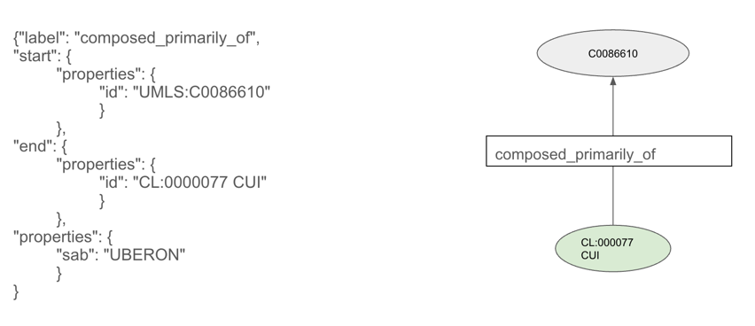
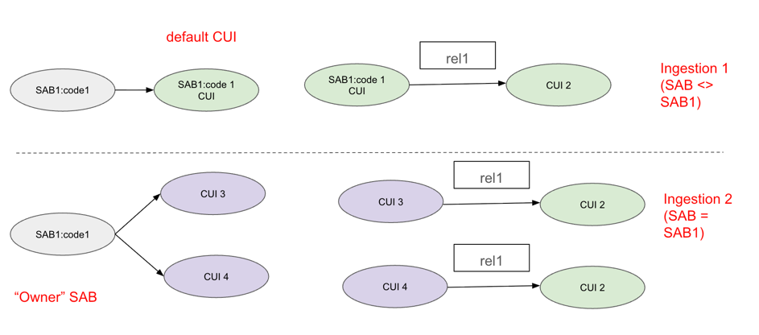

# UBKG-JKG Update algorithm

## CUIs in rels
The UBKG-JKG ingestion script associates codes from a set of [JKGEN](https://github.com/x-atlas-consortia/ubkg-jkg-generation#jkg-edgenode-jkgen-format) files 
with [Concept Unique Identifier](https://github.com/x-atlas-consortia/json-knowledge-graph#id)s (CUIs) according to the [UBKG-JKG equivalence algorithm](https://github.com/x-atlas-consortia/ubkg-jkg-generation/blob/main/docs/UBKG-JKG%20equivalence%20algorithm.md).

The JKG represents concept-concept relationships with objects in the **rels** array. Each rel object that is not 
a _coderel_ (where _label_="CODE") involves the CUIs of two Concept nodes.

For example, UBERON ingestion asserts a **_primarily_composed_of_** relationship between UMLS CUI C00866 and the CUI for 
the code 0000077 in Cell Ontology. 

Because CL is not in JKG when UBERON is ingested, the ingestion script mints a new "default CUI" for the CL code, using the code's value--in 
this case, **CL:0000077**.

## Updates to CUIs in subsequent ingestions

The JKG JSON is constructed iteratively: information from different SABs are 
added to an existing JKG JSON. It is likely that a node from one ingestion that was 
assigned a default CUI will be associated with CUIs in a subsequent ingestion of the 
node's "owner" SAB. For example, CL:0000077 is cross-referenced to FMA:66773 in the CL
JKGEN.

If the SAB that owns a node's code is ingested into JKG such that the code links to "non-default CUIs", then
the rels that use the default CUI must be updated to reflect the new CUI assignments. 
Updating these previously ingested rels allows these rels to integrate with information from the node's SAB.

Updates to CUIs only occur when the node's "owning" SAB is ingested. 

## Algorithm
For each node,
1. Assign new CUIs (including cross-references)
2. Identify all previously ingested rels for which the default CUI was the starting concept.
3. Add new rels with the new CUIs as starting concepts.
4. Delete the original rels with the default CUI was the starting concept.
5. Identify all previously ingested rels for which the default CUI was the ending concept.
6. Add new rels with the new CUIs as ending concepts.
7. Delete the original rels with the default CUI.
8. Delete the original codrels that involve the default CUI.

It is possible that both the starting and ending concepts in a rel from a previous ingestion will
need to be updated. 

